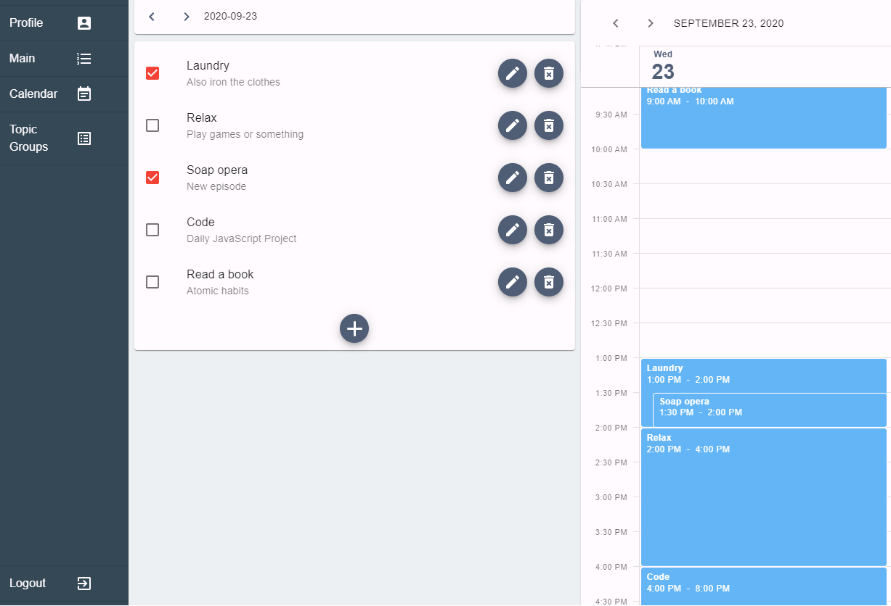

# Live
https://timeboxapp.herokuapp.com/
This is the live link, if you dont want to bother registering you can check it out with a test account:
Email: test@test.com
password: test

# TimeBoxIt
Personal Project similar to google calendar with the goal of planning your own schedule on a calendar.
Project is still not live, when it is the link will be available here.

# How to start
1. Download the project
2. Open up the terminal in the project folder
3. Use "npm install" and "npm run client-install" to install the required node packages
4. Run "npm run dev" to run client-side and server concurrently
5. Open up Localhost:3000/ to check it out

# Current Stack
## Client side
* React
* Material-UI (React UI framework)
* Axios
## Back-end
* NodeJS
* ExpressJS (NodeJS back-end framework)
* GraphQL (Flexible API)
* JWT (Tokens for authentication)
* Mongoose (Framework for communication with mongo database)
## Database
* MongoDB
